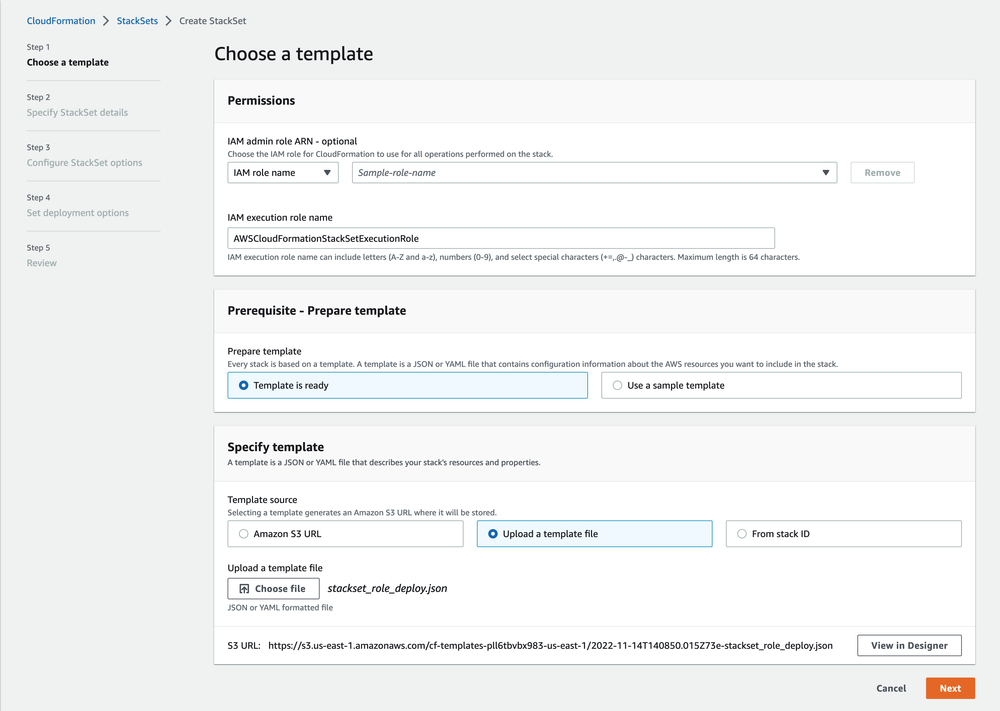
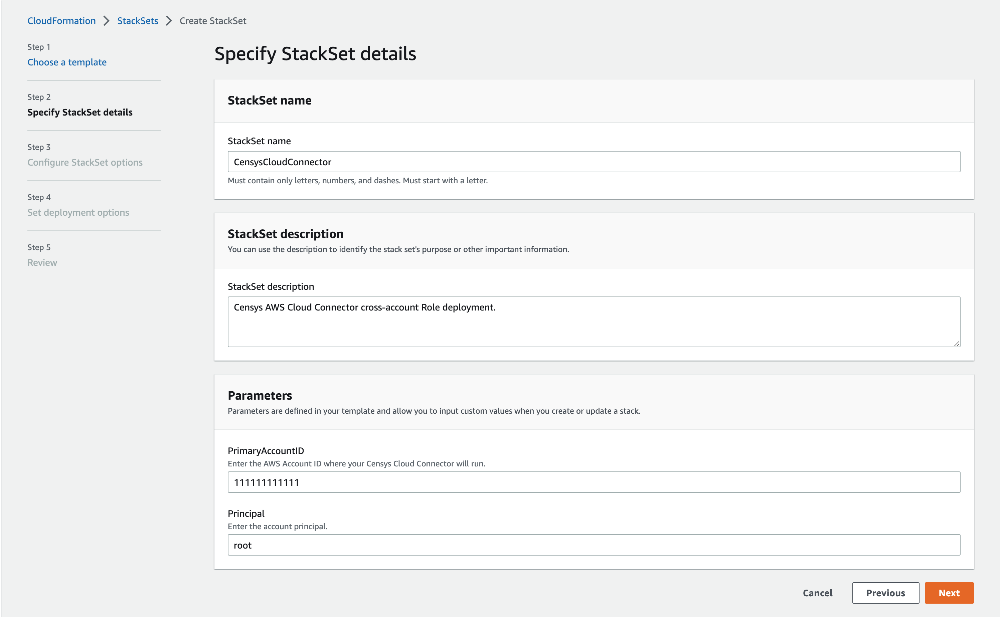
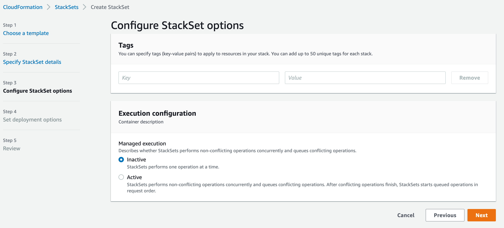
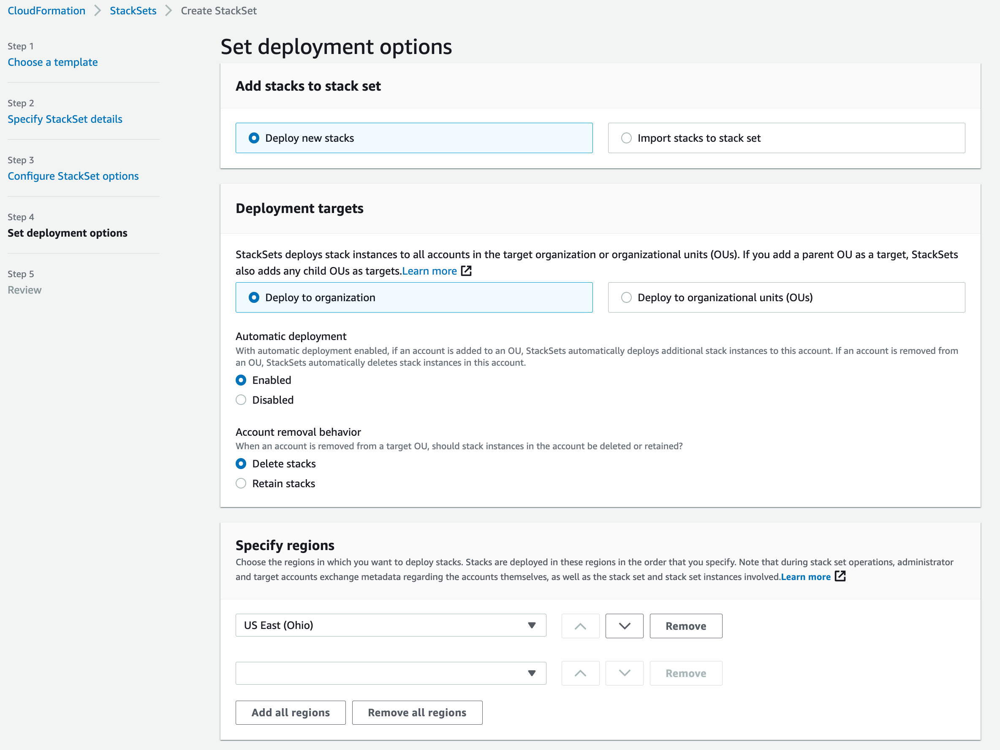
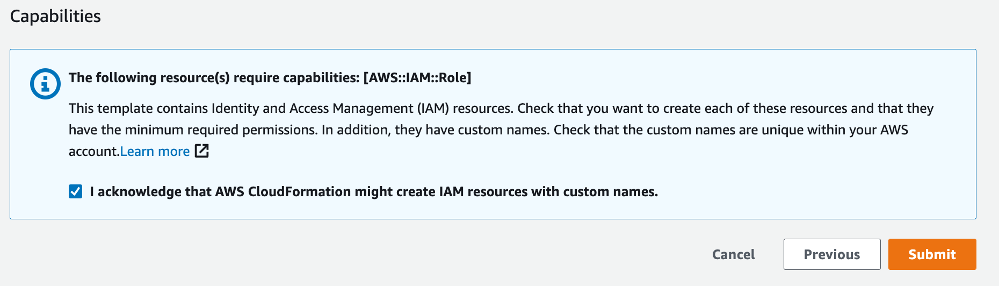

# StackSet Deployment

Add assets from all of your AWS accounts for the most up-to-date view of your
cloud attack surface.

Ready to get started? Here’s what you need:

- Your Censys ASM API key, located on the [Integrations][censys-integrations]
  page of the app.
- Sufficient privileges in your Primary AWS account to run a CloudFormation
  StackSet across all of your AWS accounts (e.g., `admin`).
- Sufficient privileges in your Primary AWS account to run a CloudFormation
  StackSet to create roles and policies (e.g., `admin`).
- You may need to [enable trusted access][aws-enable-trusted-access] with
  AWS Organizations.

## Getting Started

Log in to your Primary AWS account and navigate to
[Cloud Formation][aws-console-cloudformation].

### 1: Create a Role via CloudFormation StackSets

Use the Censys-provided template to create a role in all of your accounts for
cross-account access.

1. {download}`Download <../../templates/aws/stackset_role_deploy.json>` the
   StackSet template.
2. From the CloudFormation landing page, click **StackSets**.
3. Click the **Create StackSet** button.
4. In the **Prerequisite** section, select the "Template is ready" option.
5. In the **Specify template** section, select "Upload a template file".
6. Click **Choose file**.
7. Choose the template from Step 1.

Click **Next**.

### 1a: Specify StackSet Details

On the second page:

1. Give the StackSet a name, which can include uppercase and lowercase letters,
   numbers, and dashes.
2. In the **Parameters** section, paste in your Primary AWS Account ID.

Click **Next**.

### 1b: Configure StackSet Options

On the third page, nothing needs to be specified, as this stack will use all of
the default options.

You can optionally tag this stack with tags according to your organization’s
best practices.

Click **Next**.

### 1c: StackSet Deployment Options

On the fourth page, you'll specify the StackSet deployment options. Censys
suggests deploying the StackSet to your organization to ensure that all AWS
Accounts are accounted for.

1. In the Deployment targets section, keep the default option of "Deploy to
   organization," or specify only certain organizational units.
2. In the Specify regions section, add your preferred region.

Click **Next**.

### 1d: Review & Submit

On the review page, check all of the settings and confirm that you are aware
that this stack will create a role with a custom name in order to run properly
by checking the box next to the acknowledgment statement.

When this StackSet completes successfully, you'll have the required
cross-account role set up to allow the Cloud Connector to read from all of your
AWS accounts.

Finally, the StackSet must also be installed in the parent account. Otherwise,
you will encounter permission denied errors.

<!-- References -->
[aws-console-cloudformation]: https://console.aws.amazon.com/cloudformation/home
[aws-enable-trusted-access]: https://docs.aws.amazon.com/AWSCloudFormation/latest/UserGuide/stacksets-orgs-enable-trusted-access.html
[censys-integrations]: https://app.censys.io/integrations
