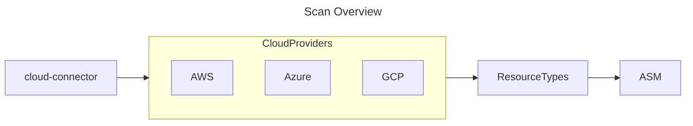
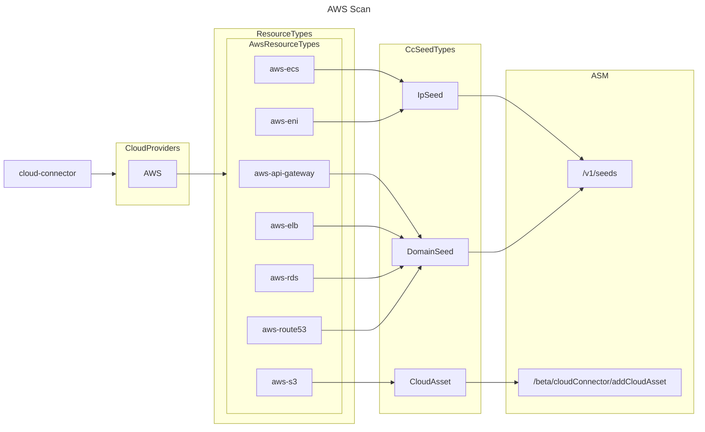
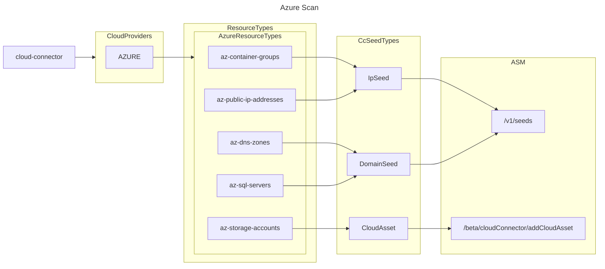
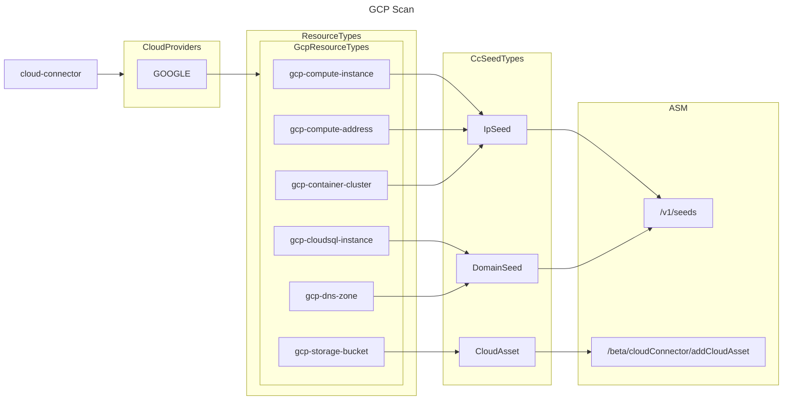

# Architecture

```mermaid
---
title: Scan Overview
---
flowchart LR
    cloud-connector --> CloudProviders
    CloudProviders --> ResourceTypes
    ResourceTypes --> ASM

    subgraph CloudProviders
        direction TB
        AWS
        Azure
        GCP
        end

```

## AWS

```mermaid
---
title: AWS Scan
---
flowchart LR
    cloud-connector --> CloudProviders
    AWS --> AwsResourceTypes

    aws-api-gateway --> DomainSeed
    aws-ecs --> IpSeed
    aws-eni --> IpSeed
    aws-elb --> DomainSeed
    aws-rds --> DomainSeed
    aws-route53 --> DomainSeed
    aws-s3 --> CloudAsset

    IpSeed --> ASMSeed
    DomainSeed --> ASMSeed
    CloudAsset --> ASMCloudAsset

    subgraph CloudProviders
        direction TB
        AWS
        end

    subgraph ResourceTypes
        subgraph AwsResourceTypes
            direction TB
            aws-api-gateway
            aws-ecs
            aws-eni
            aws-elb
            aws-rds
            aws-route53
            aws-s3
            end
    end

    subgraph CcSeedTypes
        direction TB
        DomainSeed
        IpSeed
        CloudAsset
        end

    subgraph ASM
        direction TB
        ASMSeed["/v1/seeds"]
        ASMCloudAsset["/beta/cloudConnector/addCloudAsset"]
        end
```

## Azure

```mermaid
---
title: Azure Scan
---
flowchart LR
    cloud-connector --> CloudProviders
    AZURE --> AzureResourceTypes

    az-container-groups --> IpSeed
    az-dns-zones --> DomainSeed
    az-public-ip-addresses --> IpSeed
    az-sql-servers --> DomainSeed
    az-storage-accounts --> CloudAsset

    IpSeed --> ASMSeed
    DomainSeed --> ASMSeed
    CloudAsset --> ASMCloudAsset

    subgraph CloudProviders
        direction TB
        AZURE
        end

    subgraph ResourceTypes
        subgraph AzureResourceTypes
            direction TB
            az-container-groups
            az-dns-zones
            az-public-ip-addresses
            az-sql-servers
            az-storage-accounts
            end
    end

    subgraph CcSeedTypes
        direction TB
        DomainSeed
        IpSeed
        CloudAsset
        end

    subgraph ASM
        direction TB
        ASMSeed["/v1/seeds"]
        ASMCloudAsset["/beta/cloudConnector/addCloudAsset"]
        end
```

## GCP

```mermaid
---
title: GCP Scan
---
flowchart LR
    cloud-connector --> CloudProviders
    GOOGLE --> GcpResourceTypes

    gcp-compute-instance --> IpSeed
    gcp-compute-address --> IpSeed
    gcp-container-cluster --> IpSeed
    gcp-cloudsql-instance --> DomainSeed
    gcp-dns-zone --> DomainSeed
    gcp-storage-bucket --> CloudAsset

    IpSeed --> ASMSeed
    DomainSeed --> ASMSeed
    CloudAsset --> ASMCloudAsset

    subgraph CloudProviders
        direction TB
        GOOGLE
        end

    subgraph ResourceTypes
        subgraph GcpResourceTypes
            direction TB
            gcp-compute-instance
            gcp-compute-address
            gcp-container-cluster
            gcp-cloudsql-instance
            gcp-dns-zone
            gcp-storage-bucket
            end
    end

    subgraph CcSeedTypes
        direction TB
        DomainSeed
        IpSeed
        CloudAsset
        end

    subgraph ASM
        direction TB
        ASMSeed["/v1/seeds"]
        ASMCloudAsset["/beta/cloudConnector/addCloudAsset"]
        end
```
